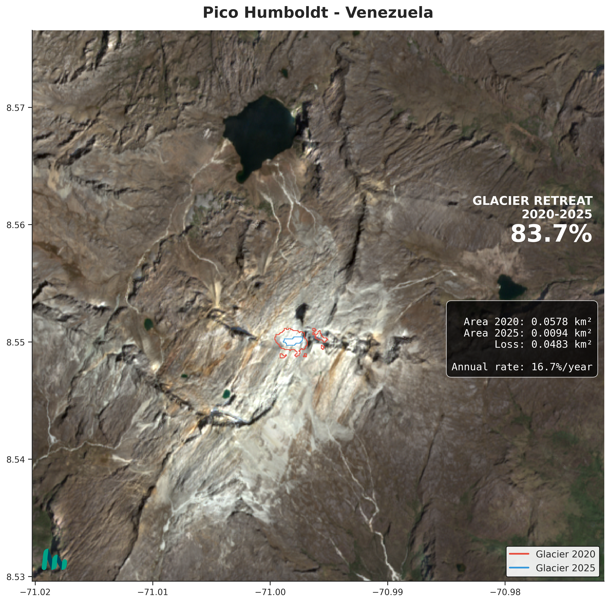
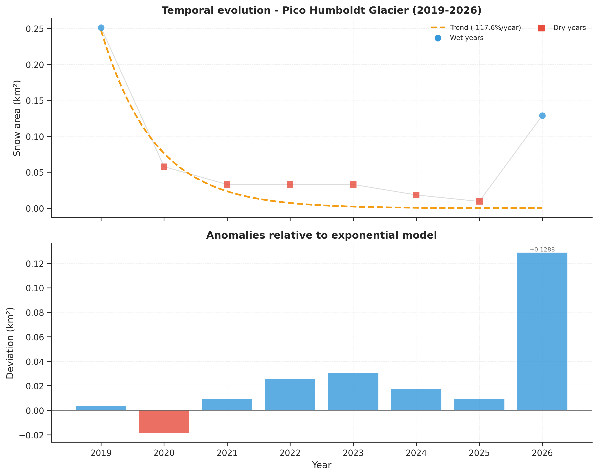
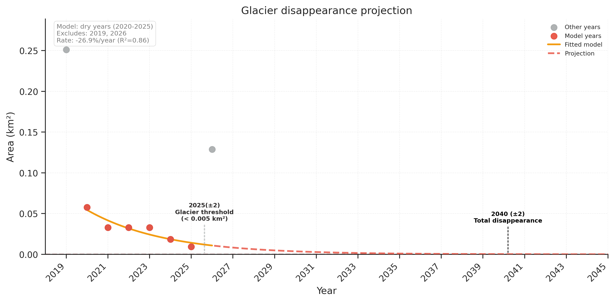

# 🏔️ Pico Humboldt Glacier - Monitoring Venezuela's Last Glacier

**Snow cover dynamics analysis (2019-2026) using Sentinel-2 satellite imagery**

[](https://www.python.org/)
[](https://streamlit.io/)
[](https://creativecommons.org/licenses/by/4.0/)

---

## 📋 Description

The La Corona glacier on Pico Humboldt (4,942 m a.s.l.) is the last remaining glacier in Venezuela. This project establishes an **automated monitoring system** based on spectral analysis of Sentinel-2 imagery to quantify glacier retreat over the 2019-2026 period.

**NOTE**: Imagery acquisition was attempted from 2015 (Sentinel-2 availability), but cloud cover was too high in the area in the 2015-2018 period.

### Main Objectives

1. **Quantify** the temporal evolution of glacier area using the Normalized Difference Snow Index (NDSI)
2. **Model** the retreat rate and project critical disappearance thresholds
3. **Develop** interactive visualizations for scientific communication and outreach

---

## Main Products

| Product | Description | Format |
|---------|-------------|--------|
| **Interactive dashboard** | Web visualization with 2D/3D maps and temporal charts | Streamlit |
| **Time series 2019-2026** | Annual metrics: area, NDSI, variability | CSV |
| **Predictive model** | Exponential regression (R²=0.86) with projections | Metadata JSON |
| **Scientific figures** | 4 figures + 1 comparative RGB image | PNG (300 DPI) |
| **Glacier polygons** | Annual vector geometries | GeoJSON |

---

## Technology Stack

- **Google Earth Engine (Python API):** Cloud-based Sentinel-2 image processing
- **GeoPandas/Rasterio:** Geospatial analysis and DEM processing
- **SciPy/NumPy/Pandas:** Analysis and modeling
- **Matplotlib/Plotly:** Visualization
- **Streamlit:** Web dashboard
- **Folium:** 2D interactive maps

---

## Key Results

### 2026 Metrics
- **Glacier area:** 0.1289 km²
- **Total loss (2020-2026):** 77.7%
- **Average annual rate:** -26.85%/year (dry years)

### Projections
- **Glacier threshold (0.005 km²):** ~2028 (±2 years)
- **Practical disappearance:** ~2040 (±3 years)

### External Validation
- **Ramírez et al. (2020):** 0.046 km² (2019)
- **This study:** 0.058 km² (2020)
- **Relative difference:** +28.4% (expected given methodological differences)

---

### Spatial Comparison of the Glacier (2020 vs 2025)



*The satellite image reveals a significant glacier retreat of **83.7% in just 5 years**,
with visible fragmentation of the remaining ice and drastic reduction of the glacier core.*

---

### Temporal Evolution and Anomalies (2019-2026)



*An accelerated decrease in glacier area is observed, with interannual variability influenced
by climatic conditions (dry vs wet years). The exponential model captures the collapse trend.*

---

### Glacier Disappearance Projection



*The exponential model projects the glacier will reach the critical threshold (~0.005 km²) around **2028 (±2 years)**,
with practical disappearance estimated by **2040**, evidencing an irreversible process under current conditions.*

---

## Methodology

### 1. Data Acquisition
- **Source:** Sentinel-2 L2A (SR)
- **Period:** 2019-2026 (8 years)
- **Temporal window:** December 15 of the previous year to March 15 of the analyzed year (dry season)
- **Filters:** Cloud cover <60%, AOI of 4 km²

### 2. Spectral Processing
- **Index:** NDSI = (Green - SWIR1) / (Green + SWIR1)
- **Threshold:** NDSI ≥ 0.4 (snow/ice)
- **Computation resolution:** Mixed: 10 m (RGB bands) / 20 m (SWIR)
- **Metrics:** Area, mean NDSI, standard deviation, CV

### 3. Annual Classification
- **Dry years (permanent glacier):** Area <0.060 km²
- **Wet years (seasonal snow):** Area ≥0.060 km²
- **Dry years used for modeling:** 2020-2025 (n=6)

### 4. Predictive Modeling
- **Models evaluated:** Linear, Exponential, Polynomial
- **Selection criterion:** AIC (Akaike Information Criterion)
- **Selected model:** Exponential decay
  - Equation: A(t) = 0.0227 × exp(-0.2685 × (t - 2020))
  - R² = 0.863
  - RMSE = ±0.0028 km²

### 5. Projections
- **Glacier threshold:** 0.005 km² (Huss & Fischer, 2016)
- **Practical disappearance:** <0.0001 km² (< 1 Sentinel-2 pixel)
- **Uncertainty:** ±1.96 × RMSE (95% interval)

---

## 🚀 Demo

Available at: https://humboldt-glacier.streamlit.app/

The deployed Streamlit version **uses preprocessed files included in the repository**.
That is, the web app **does not run Google Earth Engine in real time**.

### The app directly consumes:
- `data/snow_stats_2015_2026.csv`
- `data/processing_metadata.json`
- `data/humboldt_dem_30m.tif`
- `data/glacier_polygons/*.geojson`
- `results/plots/comparison_2020_2025.png`

---

## Quick Start

### Prerequisites
- Python 3.12+
- Google Earth Engine account ([register here](https://earthengine.google.com/))
- GEE project created
- Replace the project ID in `scripts/01_processing_gee.py` at line:

```bash
 ee.Initialize(project='your_project_id')
```

### Installation
```bash
# Clone repository
git clone https://github.com/leomed512/humboldt-glacier.git
cd humboldt-glacier

# Create virtual environment
python -m venv gee_env
source gee_env/bin/activate  # On Windows: gee_env\Scripts\activate

# Install dependencies
pip install -r requirements.txt

# Authenticate GEE (first time only)
earthengine authenticate
```

### Running
```bash
# 1. Extract data from GEE
python scripts/01_processing_gee.py

# 2. Statistical analysis and plot generation
python scripts/02_analysis.py

# 3. Launch interactive dashboard
streamlit run scripts/03_dashboard.py
```

---

## References

1. **Hall, D. K., Riggs, G. A., & Salomonson, V. V.** (1995). Development of methods for mapping global snow cover using moderate resolution imaging spectroradiometer data. *Remote Sensing of Environment*, 54(2), 127-140. https://doi.org/10.1016/0034-4257(95)00137-P

2. **Dozier, J.** (1989). Spectral signature of alpine snow cover from the Landsat Thematic Mapper. *Remote Sensing of Environment*, 28, 9-22. https://doi.org/10.1016/0034-4257(89)90101-6

3. **Huss, M., & Fischer, M.** (2016). Sensitivity of very small glaciers in the Swiss Alps to future climate change. *Frontiers in Earth Science*, 4, 34. https://doi.org/10.3389/feart.2016.00034

4. **Rabatel, A., Francou, B., Soruco, A., et al.** (2013). Current state of glaciers in the tropical Andes: a multi-century perspective on glacier evolution and climate change. *The Cryosphere*, 7(1), 81-102. https://doi.org/10.5194/tc-7-81-2013

5. **Veettil, B. K., Wang, S., Florêncio de Souza, S., et al.** (2017). Glacier monitoring and glacier-climate interactions in the tropical Andes: A review. *Journal of South American Earth Sciences*, 77, 218-246. https://doi.org/10.1016/j.jsames.2017.04.009

6. **Ramírez, N., Villalba, L., Argollo, J., et al.** (2020). The end of the eternal snows: Integrative mapping of 100 years of glacier retreat in the Venezuelan Andes. *Arctic, Antarctic, and Alpine Research*, 52(1), 563-587. https://doi.org/10.1080/15230430.2020.1822894

7. **Schubert, C.** (1992). The glaciers of the Sierra Nevada de Mérida (Venezuela): A photographic comparison of recent deglaciation. *Erdkunde*, 46(1), 58-64.

8. **Benn, D. I., & Evans, D. J. A.** (2010). *Glaciers and Glaciation* (2nd ed.). Hodder Education. ISBN: 978-0340905791

9. **Gorelick, N., Hancher, M., Dixon, M., et al.** (2017). Google Earth Engine: Planetary-scale geospatial analysis for everyone. *Remote Sensing of Environment*, 202, 18-27. https://doi.org/10.1016/j.rse.2017.06.031

### Digital Elevation Model

10. **European Space Agency (ESA).** (2021). Copernicus DEM - Global and European Digital Elevation Model (COP-DEM). https://doi.org/10.5270/ESA-c5d3d65

---

## License

This work is licensed under [Creative Commons Attribution 4.0 International (CC BY 4.0)](https://creativecommons.org/licenses/by/4.0/).

**Required attribution:**
```
Author: Leonardo Medina
Project: Pico Humboldt Glacier Monitoring (2019-2026)
URL: https://github.com/leomed512/humboldt-glacier
```

---

**Scientific note:** This exploratory study complements high-precision research such as Ramírez et al. (2020), establishing a continuous monitoring protocol using open data (Sentinel-2) that enables early warnings about critical changes.