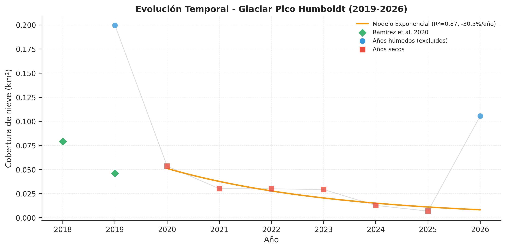
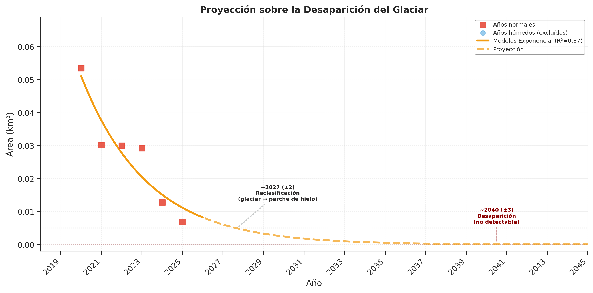

# 🏔️ Pico Humboldt Glacier - Monitoring Venezuela's Last Glacier

**Snow cover dynamics analysis (2019-2026) using Sentinel-2 satellite imagery and sub-pixel spectral unmixing**

[](https://www.python.org/)
[](https://streamlit.io/)
[](https://creativecommons.org/licenses/by/4.0/)

---

## Description

The La Corona glacier on Pico Humboldt (4,942 m a.s.l.) is the last remaining glacier in Venezuela. This project establishes an **automated monitoring system** based on spectral analysis of Sentinel-2 imagery to quantify glacier retreat over the 2019-2026 period with sub-pixel precision.

**NOTE**: Imagery acquisition was attempted from 2015 (Sentinel-2 availability), but cloud cover was too high in the area in the 2015-2018 period.

### Main Objectives

1. **Quantify** the temporal evolution of glacier area using NDSI-masked spectral unmixing for sub-pixel snow cover estimation
2. **Model** the retreat rate and project critical reclassification and disappearance thresholds
3. **Develop** interactive visualizations for scientific communication and outreach

---

## Main Products

| Product | Description | Format |
|---------|-------------|--------|
| **Interactive dashboard** | Web visualization with 2D/3D maps, projection plot, and method comparison | Streamlit |
| **Time series 2019-2026** | Annual metrics: fractional area, NDSI area, spectral statistics | CSV |
| **Predictive model** | Exponential regression (R²=0.87) with reclassification and disappearance projections | Metadata JSON |
| **Scientific figures** | 4 figures + 1 comparative RGB image | PNG (300 DPI) |
| **Glacier polygons** | Annual vector geometries | GeoJSON |

---

## Technology Stack

- **Google Earth Engine (Python API):** Cloud-based Sentinel-2 image processing
- **Spectral Unmixing (FCLSU):** Sub-pixel fractional snow cover estimation with calibrated endmembers
- **GeoPandas/Rasterio:** Geospatial analysis and DEM processing
- **SciPy/NumPy/Pandas:** Analysis and modeling
- **Matplotlib/Plotly:** Visualization
- **Streamlit:** Web dashboard
- **Folium:** 2D interactive maps

---

## Key Results

### 2025 Metrics (last dry year)
- **Glacier area:** 0.0069 km² (FCLSU unmixing)
- **Total loss (2020-2025):** 87.1%
- **Average annual rate:** -30.5%/year (dry years, exponential model)

### Projections
- **Reclassification** (glacier → ice patch, <0.005 km²): **~2027** (±2 years)
- **Disappearance** (below Sentinel-2 detection): **~2040** (±3 years)

### External Validation
- **Ramírez et al. (2020) for 2019** 0.046 km² (2019, manual photointerpretation)
- **This study for 2020:** 0.0535 km² (FCLSU unmixing + NDSI masking)
- **Relative difference:** +16.3% (consistent with resolution and methodological differences), initially +25.7% using pure NDSI, but improved with FCLSU*.

### * Methodological Improvement
- **NDSI binary (traditional):** 0.0578 km² for 2020 (+25.7% vs Ramírez)
- **FCLSU unmixing:** 0.0535 km² for 2020 (+16.3% vs Ramírez)
- **Overestimation reduced by 9.4 percentage points** (~36% of original bias eliminated)
- Correction amplifies for smaller glacier areas: -7.4% in 2020, -26.6% in 2025

---

### Spatial Comparison of the Glacier (2020 vs 2025)


*The satellite image reveals significant glacier retreat of **87.1% in 5 years**,
with visible fragmentation of the remaining ice and drastic reduction of the glacier core.*

---

### Temporal Evolution (2019-2026)



*Accelerated decrease in glacier area, with Ramírez et al. (2020) reference points 
validating the observed trend. Wet years (2019, 2026) excluded from model due to seasonal snow.*

---

### Glacier Disappearance Projection



*The exponential model projects reclassification (glacier → ice patch) around **~2027 (±2 years)** based on Huss & Fischer (2016) classification,
with disappearance below detection estimated by **~2040 (±3 years)**, *

---

## Methodology

### 1. Data Acquisition
- **Source:** Sentinel-2 L2A (SR Harmonized)
- **Period:** 2019-2026 (8 years)
- **Temporal window:** December 15 (year-1) to March 15 (year) — dry season
- **Filters:** Cloud cover <60%, SCL mask, AOI of 4 km²

### 2. Area Estimation: NDSI-Masked Spectral Unmixing
- **Pre-mask:** NDSI ≥ 0.2 (candidate zone screening)
- **Method:** Fully Constrained Linear Spectral Unmixing (FCLSU)
  - 3 endmembers: snow, rock, páramo vegetation
  - 6 Sentinel-2 bands: B2, B3, B4, B8, B11, B12
  - Constraints: sum-to-one, non-negativity
- **Endmember calibration:** Pure pixels identified in QGIS, validated by spectral separability (>21° all pairs)
- **Area calculation:** Continuous fractional sum (each pixel contributes fraction × pixel area)
- **Polygon generation:** Binary mask from fraction ≥ 0.5, vectorized at 10 m
- **Reference comparison:** NDSI ≥ 0.4 binary area computed in parallel for validation

### 3. Annual Classification
- **Dry years (permanent glacier):** Area <0.060 km²
- **Wet years (seasonal snow):** Area ≥0.060 km²
- **Dry years used for modeling:** 2020-2025 (n=6)

### 4. Predictive Modeling
- **Models evaluated:** Exponential, Linear, Polynomial
- **Selection criterion:** AICc (corrected for small samples; Burnham & Anderson, 2002)
- **Selected model:** Exponential decay (theoretical basis: Huss & Fischer, 2016)
  - R² = 0.874
  - RMSE = ±0.0053 km²

### 5. Projections
- **Reclassification threshold:** 0.005 km² — glacier → ice patch (Huss & Fischer, 2016)
- **Disappearance threshold:** 0.0001 km² — below Sentinel-2 detection (~1 pixel at 20 m)
- **Uncertainty:** ±1.96 × RMSE (95% interval)

---

## 🚀 Demo

Available at: https://glaciar-humboldt-ve.streamlit.app/

The deployed Streamlit version **uses preprocessed files included in the repository**.
The web app **does not run Google Earth Engine in real time**.

### The app directly consumes:
- `data/snow_stats_2015_2026.csv`
- `data/processing_metadata.json`
- `data/humboldt_dem_30m.tif`
- `data/glacier_polygons/*.geojson`
- `results/plots/*.png`

---

## Quick Start

### Prerequisites
- Python 3.12+
- Google Earth Engine account ([register here](https://earthengine.google.com/))
- GEE project created
- Replace the project ID in `scripts/01_processing_gee.py` at line:

```bash
 ee.Initialize(project='your_project_id')
```

### Installation
```bash
# Clone repository
git clone https://github.com/leomed512/humboldt-glacier.git
cd humboldt-glacier

# Create virtual environment
python -m venv gee_env
source gee_env/bin/activate  # On Windows: gee_env\Scripts\activate

# Install dependencies
pip install -r requirements.txt

# Authenticate GEE (first time only)
earthengine authenticate
```

### Running
```bash
# 1. Extract data from GEE (includes spectral unmixing)
python scripts/01_processing_gee.py

# 2. Statistical analysis and plot generation
python scripts/02_analysis_visualization.py

# 3. Launch interactive dashboard
streamlit run scripts/03_dashboard.py
```

---

## References

1. **Hall, D. K., Riggs, G. A., & Salomonson, V. V.** (1995). Development of methods for mapping global snow cover using moderate resolution imaging spectroradiometer data. *Remote Sensing of Environment*, 54(2), 127-140. https://doi.org/10.1016/0034-4257(95)00137-P

2. **Dozier, J.** (1989). Spectral signature of alpine snow cover from the Landsat Thematic Mapper. *Remote Sensing of Environment*, 28, 9-22. https://doi.org/10.1016/0034-4257(89)90101-6

3. **Huss, M., & Fischer, M.** (2016). Sensitivity of very small glaciers in the Swiss Alps to future climate change. *Frontiers in Earth Science*, 4, 34. https://doi.org/10.3389/feart.2016.00034

4. **Rabatel, A., Francou, B., Soruco, A., et al.** (2013). Current state of glaciers in the tropical Andes: a multi-century perspective on glacier evolution and climate change. *The Cryosphere*, 7(1), 81-102. https://doi.org/10.5194/tc-7-81-2013

5. **Veettil, B. K., Wang, S., Florêncio de Souza, S., et al.** (2017). Glacier monitoring and glacier-climate interactions in the tropical Andes: A review. *Journal of South American Earth Sciences*, 77, 218-246. https://doi.org/10.1016/j.jsames.2017.04.009

6. **Ramírez, N., Villalba, L., Argollo, J., et al.** (2020). The end of the eternal snows: Integrative mapping of 100 years of glacier retreat in the Venezuelan Andes. *Arctic, Antarctic, and Alpine Research*, 52(1), 563-587. https://doi.org/10.1080/15230430.2020.1822894

7. **Schubert, C.** (1992). The glaciers of the Sierra Nevada de Mérida (Venezuela): A photographic comparison of recent deglaciation. *Erdkunde*, 46(1), 58-64.

8. **Benn, D. I., & Evans, D. J. A.** (2010). *Glaciers and Glaciation* (2nd ed.). Hodder Education. ISBN: 978-0340905791

9. **Gorelick, N., Hancher, M., Dixon, M., et al.** (2017). Google Earth Engine: Planetary-scale geospatial analysis for everyone. *Remote Sensing of Environment*, 202, 18-27. https://doi.org/10.1016/j.rse.2017.06.031

10. **Painter, T. H., Rittger, K., McKenzie, C., et al.** (2009). Retrieval of subpixel snow covered area, grain size, and albedo from MODIS. *Remote Sensing of Environment*, 113(4), 868-879. https://doi.org/10.1016/j.rse.2009.01.001

11. **Sirguey, P., Mathieu, R., & Arnaud, Y.** (2009). Subpixel monitoring of the seasonal snow cover with MODIS at 250 m spatial resolution. *Remote Sensing of Environment*, 113(4), 738-749. https://doi.org/10.1016/j.rse.2008.12.002

12. **Burnham, K. P., & Anderson, D. R.** (2002). *Model Selection and Multimodel Inference* (2nd ed.). Springer. https://doi.org/10.1007/b97636

### Digital Elevation Model

13. **European Space Agency (ESA).** (2021). Copernicus DEM - Global and European Digital Elevation Model (COP-DEM). https://doi.org/10.5270/ESA-c5d3d65

---

## License

This work is licensed under [Creative Commons Attribution 4.0 International (CC BY 4.0)](https://creativecommons.org/licenses/by/4.0/).

**Required attribution:**
```
Author: Leonardo Medina
Project: Pico Humboldt Glacier Monitoring (2019-2026)
URL: https://github.com/leomed512/humboldt-glacier
```

---

**Scientific note:** This exploratory study complements high-precision research such as Ramírez et al. (2020), establishing a continuous monitoring protocol using open data (Sentinel-2) and sub-pixel spectral unmixing that enables early warnings about critical changes.